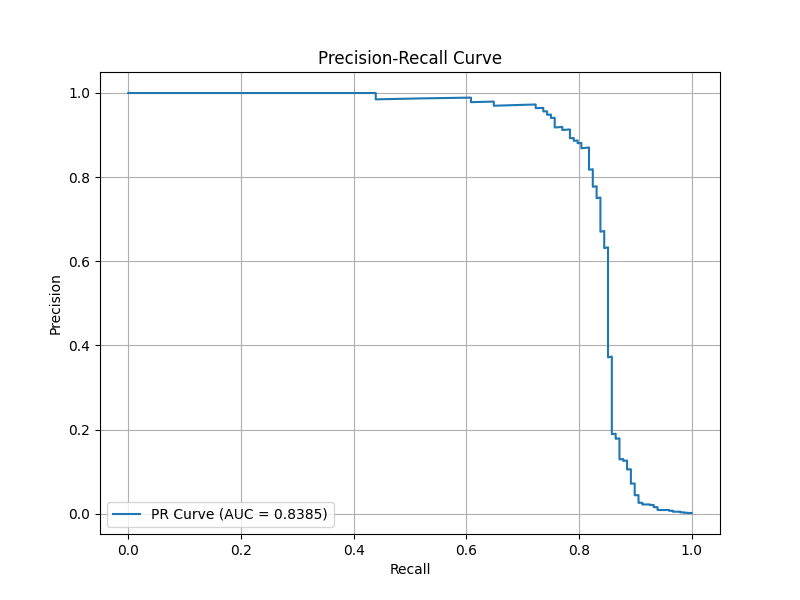
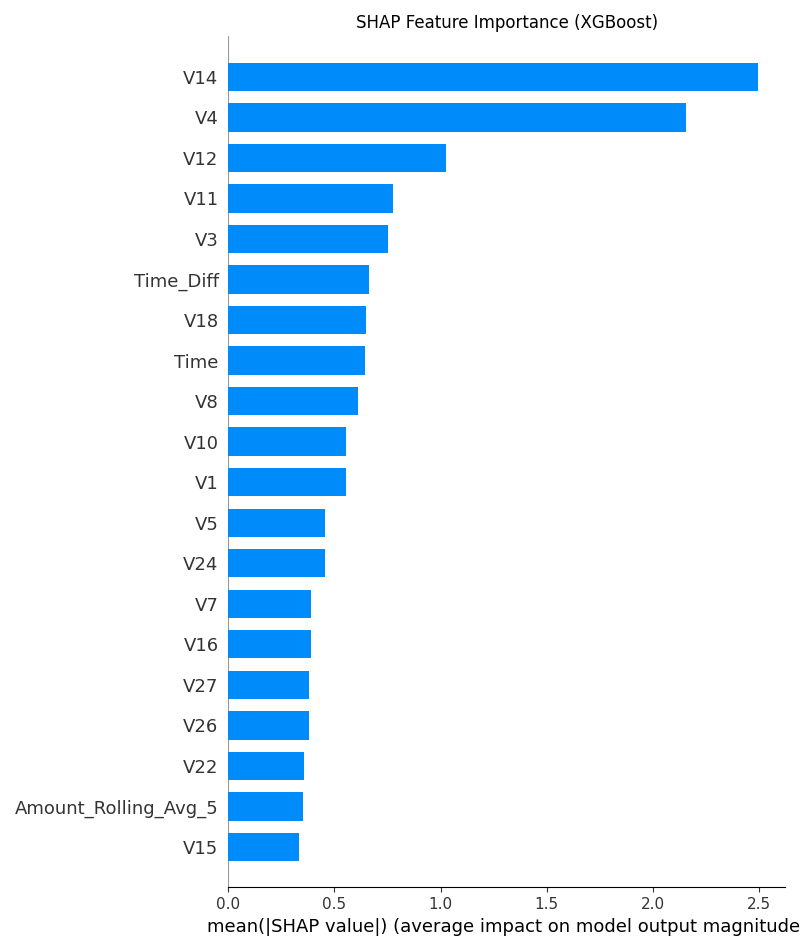

# Credit Card Fraud Detection

This project implements a sophisticated machine learning pipeline to detect fraudulent credit card transactions. It leverages advanced feature engineering, a stacked ensemble model, and state-of-the-art interpretability techniques to achieve high performance on a highly imbalanced dataset.

## Table of Contents
- [Project Overview](#project-overview)
- [Initial Analysis and Baseline Models](#initial-analysis-and-baseline-models)
- [Summary of Final Model Findings](#summary-of-final-model-findings)
- [Key Features of Final Model](#key-features-of-final-model)
- [Final Model Performance](#final-model-performance)
- [Feature Importance](#feature-importance)
- [How to Run](#how-to-run)
- [Dependencies](#dependencies)

## Project Overview

The goal of this project is to accurately identify fraudulent transactions from a dataset of credit card transactions. The dataset is known for being highly imbalanced, with fraudulent transactions making up a very small fraction of the total. This project addresses this challenge by employing:
- **Advanced Feature Engineering** to create more informative predictors.
- **SMOTE (Synthetic Minority Over-sampling Technique)** to balance the training data.
- **A Stacked Ensemble Model** that combines the strengths of multiple classifiers.
- **SHAP (SHapley Additive exPlanations)** for model interpretability.

## Initial Analysis and Baseline Models

The initial analysis was conducted in a Jupyter Notebook (`Credit card.ipynb`) to understand the data and establish baseline performance. Key findings from this phase include:

- **Severe Class Imbalance**: The dataset consists of 284,807 transactions, of which only 492 (0.172%) are fraudulent. This confirms the need for specialized techniques to handle imbalanced data.
- **Statistical Significance of Features**: Hypothesis testing (t-tests and Chi-squared tests) revealed that several features, including `Amount` and anonymized features like `V2`, `V3`, and `V4`, show statistically significant differences between fraudulent and non-fraudulent classes. This validates their relevance for the model.
- **Baseline Model Performance**:
    - A standard **Random Forest** model (using `class_weight='balanced'`) performed poorly, achieving a **recall of only 0.037**, making it unsuitable for practical use.
    - An **XGBoost** model (using `scale_pos_weight`) showed improvement with an **AUC-ROC of 0.8886** but still had a low **recall of 0.1852**.
- **Conclusion**: The low recall of the baseline models highlighted the necessity for a more advanced approach, leading to the development of the stacked ensemble model with feature engineering and SMOTE.

## Summary of Final Model Findings

The key findings from the final, advanced model are:
- **High Model Efficacy**: The developed stacked ensemble model is highly effective at identifying fraudulent transactions. It achieves a precision of 0.85 and a recall of 0.82 for the fraud class, meaning it correctly identifies 82% of all fraudulent transactions while maintaining a high level of accuracy in its fraud predictions.
- **Robust Performance on Imbalanced Data**: The Matthews Correlation Coefficient (MCC) of **0.8315** and the Area Under the Precision-Recall Curve (AUC-PR) of **0.8385** confirm that the model is robust and reliable, performing significantly better than random guessing and the initial baseline models.
- **Impact of Feature Engineering**: The SHAP analysis reveals that the engineered feature `Time_Diff` (time since the last transaction) is one of the most significant predictors of fraud. This validates the feature engineering approach.
- **Critical Fraud Indicators**: Beyond the engineered features, the anonymized features `V14`, `V4`, and `V12` were identified as the most critical variables in distinguishing between fraudulent and legitimate transactions.

## Key Features of Final Model

- **Feature Engineering**: Two new features were created to capture transactional patterns:
    - `Time_Diff`: The time elapsed since the previous transaction.
    - `Amount_Rolling_Avg_5`: The rolling average of the last 5 transaction amounts.
- **Data Balancing**: The `imbalanced-learn` library's SMOTE was applied *only* to the training set to prevent data leakage and create a balanced dataset for model training.
- **Stacked Ensemble Model**:
    - **Level 0 (Base Models)**: A `RandomForestClassifier` and an `XGBClassifier` are trained on the data.
    - **Level 1 (Meta-Model)**: A `LogisticRegression` model is trained on the predictions of the base models to make the final classification. This approach often leads to more robust and accurate predictions.
- **Model Interpretability**: SHAP is used on the trained XGBoost model to understand which features are most influential in driving the model's predictions.

## Final Model Performance

The stacked model was evaluated on the unseen test set. The results demonstrate excellent performance in identifying fraudulent transactions while maintaining high precision.

### Classification Report

| Class       | Precision | Recall | F1-Score | Support |
|-------------|:---------:|:------:|:--------:|--------:|
| **Non-Fraud** |   1.00    |  1.00  |   1.00   |   85295 |
| **Fraud** |   0.85    |  0.82  |   0.83   |     148 |
|             |           |        |          |         |
| **Accuracy** |           |        |   1.00   |   85443 |
| **Macro Avg** |   0.92    |  0.91  |   0.92   |   85443 |
| **Weighted Avg**|   1.00    |  1.00  |   1.00   |   85443 |

- **Matthews Correlation Coefficient (MCC)**: **0.8315**
  - *An MCC of +1 represents a perfect prediction, 0 no better than random, and -1 an inverse prediction. An MCC of 0.83 indicates a very strong and reliable classification.*

### Precision-Recall Curve

The area under the PR curve (AUC-PR) is a key metric for imbalanced classification. The model achieves an excellent AUC of **0.8385**, showing a strong ability to distinguish between classes.



## Feature Importance

Using SHAP, we can identify the features that have the most impact on the model's predictions. The following plot shows the mean absolute SHAP value for each feature, indicating its overall importance. As seen, the engineered feature `Time_Diff` and several of the anonymized `V` features are critical for detection.



## How to Run

1.  **Clone the repository:**
    ```bash
    git clone <your-repository-url>
    cd <your-repository-folder>
    ```

2.  **Create and activate a virtual environment:**
    ```bash
    # Create the environment
    python -m venv venv

    # Activate it
    # On Windows:
    .\venv\Scripts\activate
    # On macOS/Linux:
    source venv/bin/activate
    ```

3.  **Install the dependencies:**
    ```bash
    pip install -r requirements.txt
    ```

4.  **Add the dataset:**
    - Download the dataset from [Kaggle](https://www.kaggle.com/datasets/mlg-ulb/creditcardfraud).
    - Place the `creditcard.csv` file in the root directory of the project.

5.  **Run the script:**
    ```bash
    python main.py
    ```
    The script will execute the entire pipeline and save `precision_recall_curve.png` and `shap_summary.png` in the project folder.

## Dependencies
The project requires the following Python libraries, listed in `requirements.txt`:
- `pandas`
- `numpy`
- `scikit-learn`
- `xgboost`
- `matplotlib`
- `seaborn`
- `imbalanced-learn`
- `shap`
